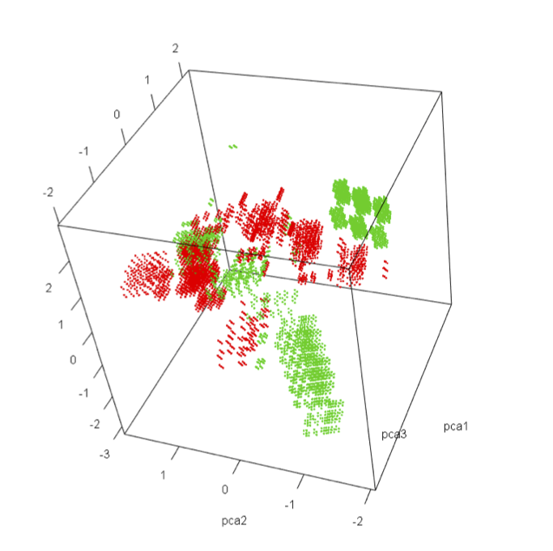
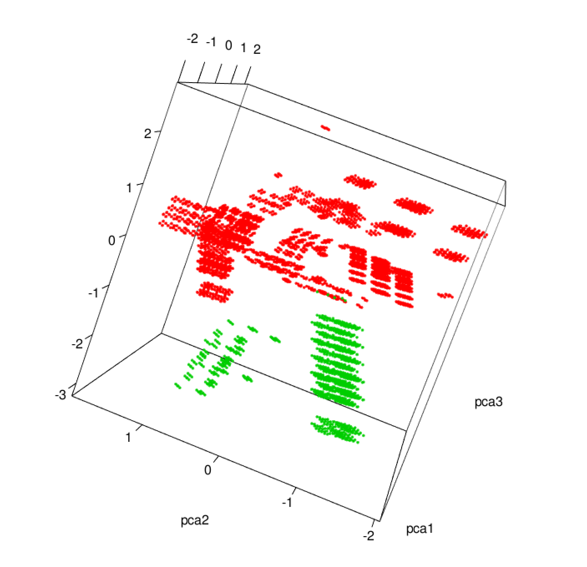
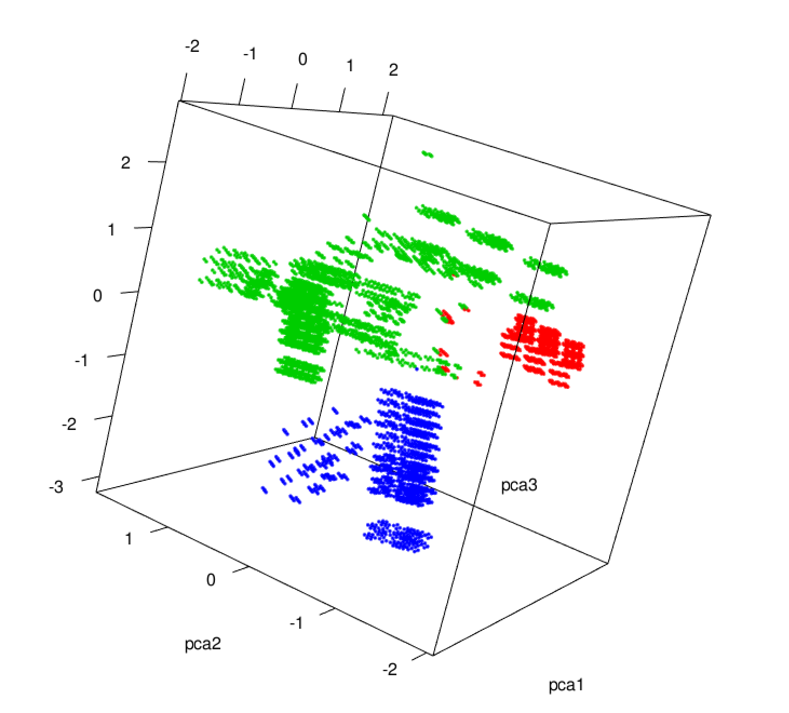
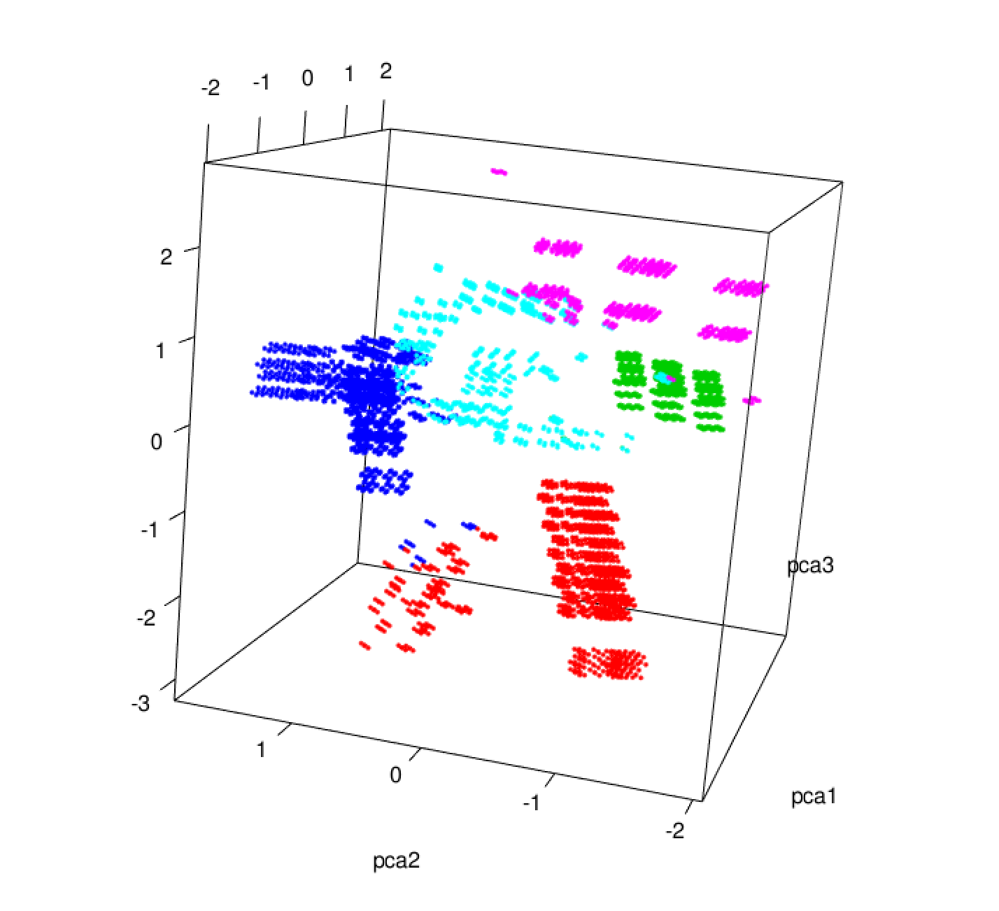
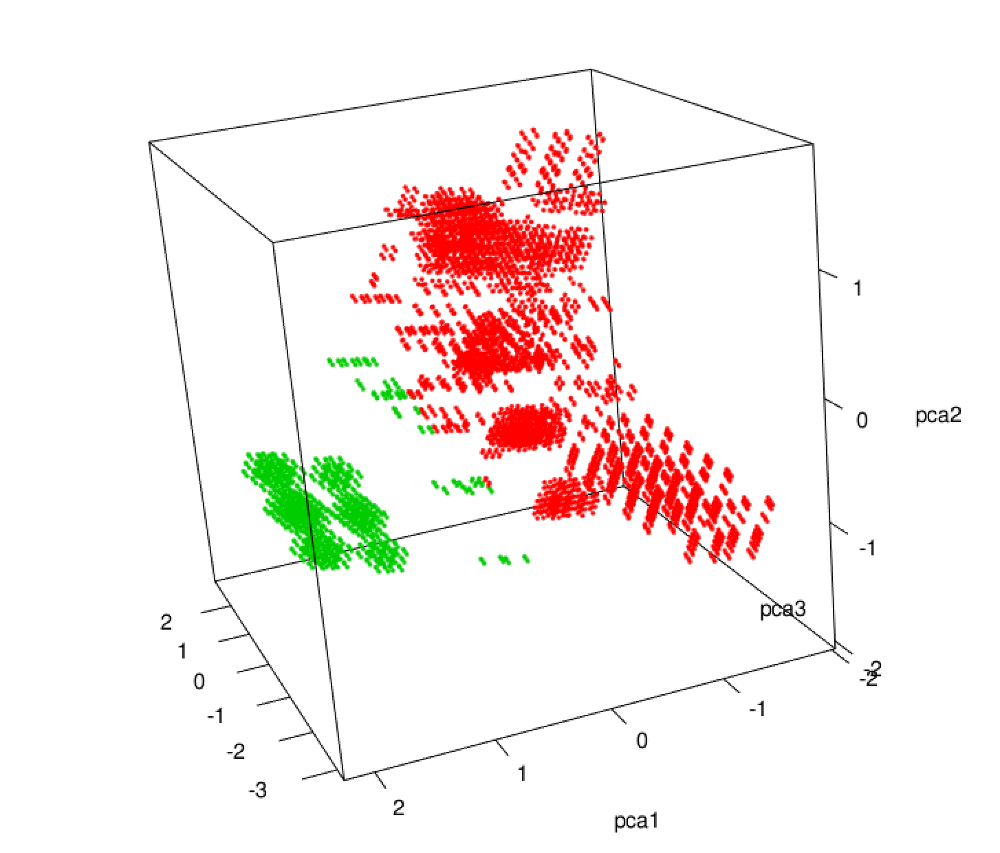
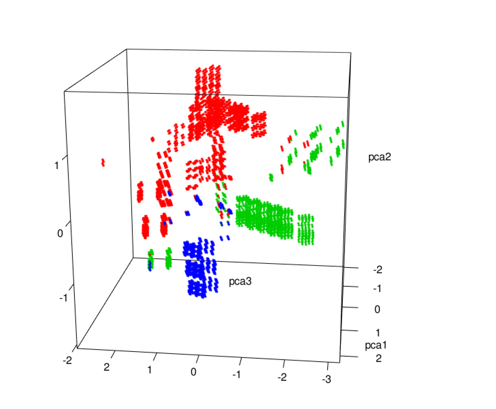

# Mushroom Clustering

## Data Set
The problem is to determine what makes a mushroom edible or not-edible. This data set includes descriptions of hypothetical samples corresponding to 23 species of gilled mushrooms in the Agaricus and Lepiota Family (pp. 500-525). Each species is identified as definitely edible, definitely poisonous, or of unknown edibility and not recommended. This latter class was combined with the poisonous one. The Guide clearly states that there is no simple rule for determining the edibility of a mushroom; no rule like ''leaflets three, let it be'' for Poisonous Oak and Ivy.

## Objective: 
As noted in the writeup, there are edible, poisonous and unsure mushroom samples. Unsure samples have been labeled as poisonous in the data set. Our job is to analyze the mushroom data set and see if we can’t find the subset of poisonous samples which correspond to unsure class. We will need samples marked both edible and poisonous to make this determination.

## Solutions:
Step 1: Clean data: map the original character dataset to a number, clean data with missing features, linearly normalize features.

Step 2: Select features: use Principal Component Analysis (PCA) to reduce the 22 attributes to 2 attributes. Improve the operation time obviously.

Step 3: Cluster and Classification.

Step 3.1: Use the k-means algorithm and the k-medoids algorithm to get the cluster result to distinguish posion mushroom. Compare the k-means algorithm and the k-medoids algorithm.

Step 3.2: Seperate the original dataset into training and test data. Use the K-nearest neighbor (KNN) to build the classifier. Use grid search to optimize the classifier. Learn about how parameters influence the classifier.

## Results:

### K-means

We also reduce the features into 2 and 3 dimensions to compare different dimensions for PCA. 

We also try the parameter k range from 2, 3, 5, 7 to see the difference.

Following are the selected results:

#### Original Dataset:

The red points are edible mushrooms, the green points are poisonous mushrooms.

There is some unsure mushroom data mixed in the poisonous mushrooms data. The green data in the left will have high possibility to be the unsure part. The green data in the right will have high possibility to be the poisonous part.

#### K = 2

The cluster result verifies previous assumption.

#### K = 3

#### K = 5

---

### K-medoids
We also reduce the features into 2 and 3 dimensions to compare different dimensions for PCA. 

We also try the parameter k range from 2, 3, 5, 7 to see the difference.

Following are the selected results:

#### K = 2

The cluster result verifies previous assumption.

#### K = 3

---

#### K-nearest neighbor (KNN)
We seperate the original data into training data and test data for ratio as 50:50, 60:40, 70:30. The accuracies with K-nearest neighbor (KNN).

|     | 50:50  | 60:40  | 70:30  |
|-----|--------|--------|--------|
| 2   | 92.74% | 92.64% | 92.67% |
| 3   | 93.18% | 93.47% | 92.86% |
| 5   | 93.65% | 94.58% | 93.84% |
| 7   | 93.97% | 93.72% | 94.41% |
| AVG | 93.39% | 93.60% | 93.45% |

Accuracies with 2 features reduced by PCA.

|     | 50:50  | 60:40  | 70:30  |
|-----|--------|--------|--------|
| 2   | 98.28% | 98.21% | 98.52% |
| 3   | 98.55% | 98.83% | 98.93% |
| 5   | 98.28% | 98.33% | 98.65% |
| 7   | 98.57% | 98.22% | 98.40% |
| AVG | 98.42% | 94.40% | 98.63% |

Accuracies with 3 features reduced by PCA.


### Members
[@Hongqiao Li](https://github.com/Hongqiao-Li)
[@Wei Li](https://github.com/wliday)
@Tianhang Qiang
@Yang Yang

### Update Note
> #### V0.9   05/16/2016
Initialize projects, provide rough results.

[originaldata]: ./screenshot/originaldata/originaldata.png
[k-means3d-2]: ./screenshot/kmeans/3d/k_means3d_2.png
[k-means3d-3]: ./screenshot/kmeans/3d/k_means3d_3.png
[k-means3d-5]: ./screenshot/kmeans/3d/k_means3d_5.png

[k-med3d-2]: ./screenshot/kmedoids/3d/k_med3d_2.png
[k-med3d-3]: ./screenshot/kmedoids/3d/k_med3d_3.png


